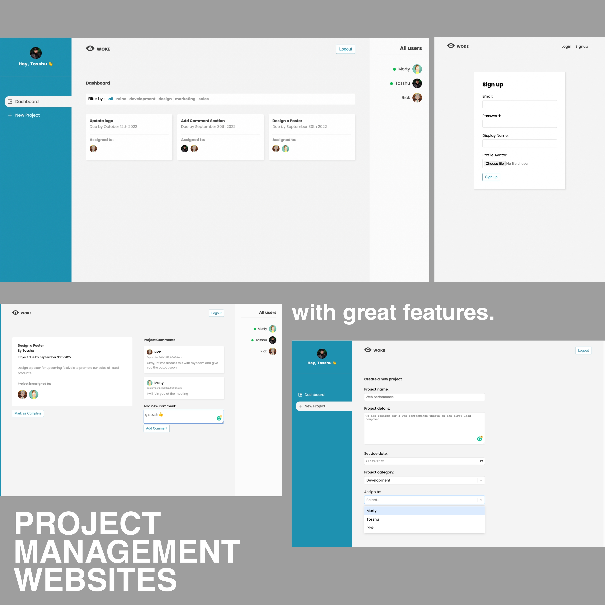

# Project Management Website Using ReactJs | Firebase |

## [Check it live here](https://project-managment-web-woke.vercel.app/)



Woke a Project Management Website website build using React and Firebase.

## Tech Info of App

- React for UI
- Firebase as serverless DB
- React Router for Routing
- CSS for styling
- MomentJs

## Features

- login/SignUp
- create Project
- asign project
- comment
- delete post
- dashboard with filters

## Getting Started

These instructions will get you a copy of the project up and running on your local machine for development and testing purposes. See deployment for notes on how to deploy the project on a live system.

### Installing

Clone the Repository and run

```
npm i
npm start
```

## Deployment

To deploy simply run

```
npm run build
```

## Built With

- React JS
- React-Router
- Custom Hooks
- React context
- Firebase


## Contributing

Please feel free to send pull request if you want to contribute!
